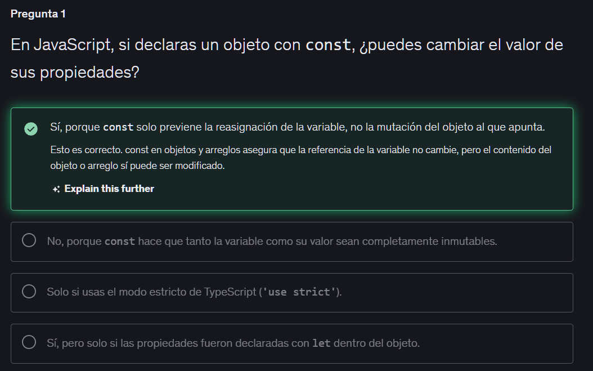
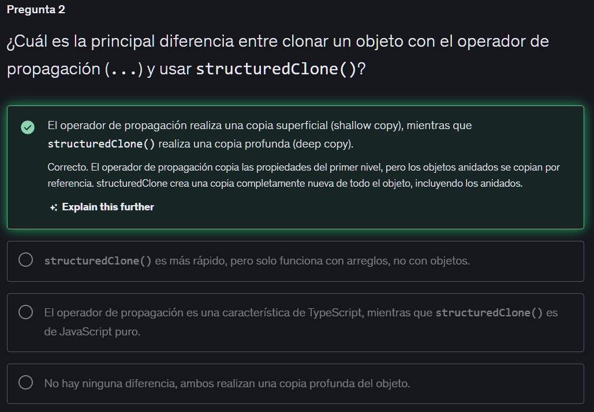
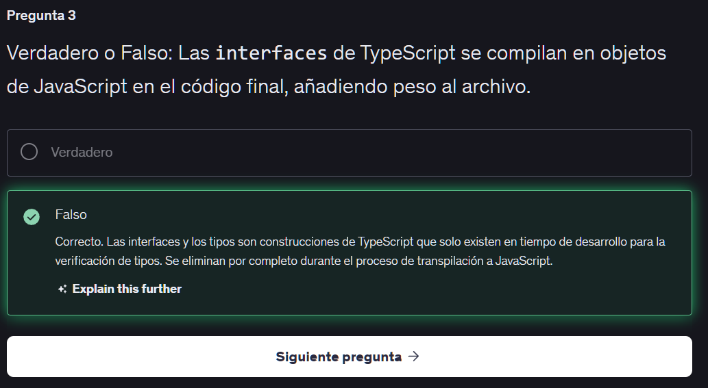
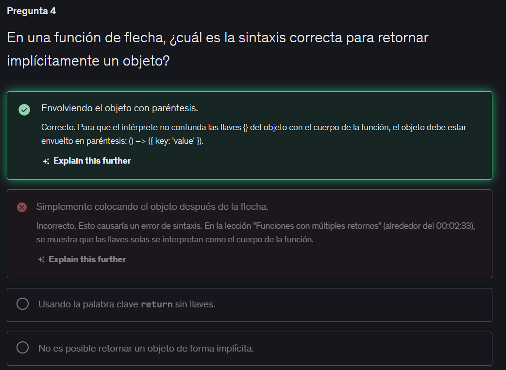
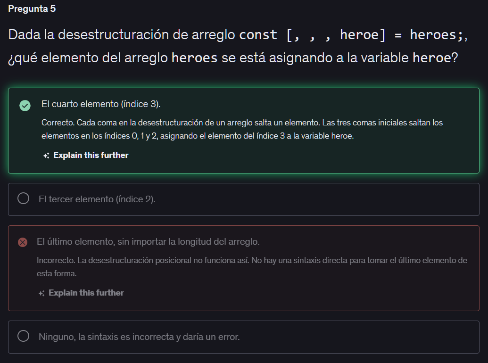
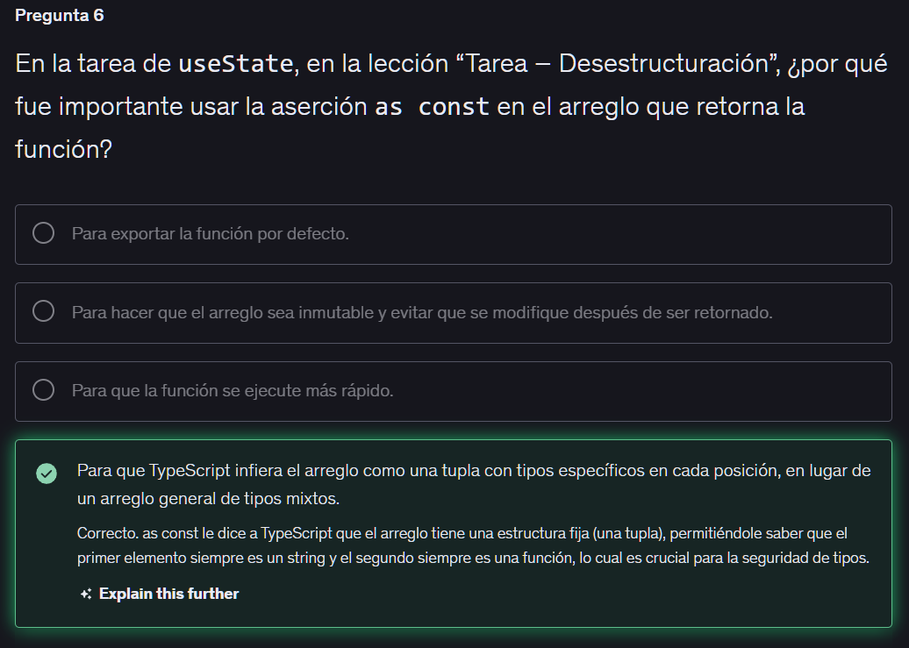
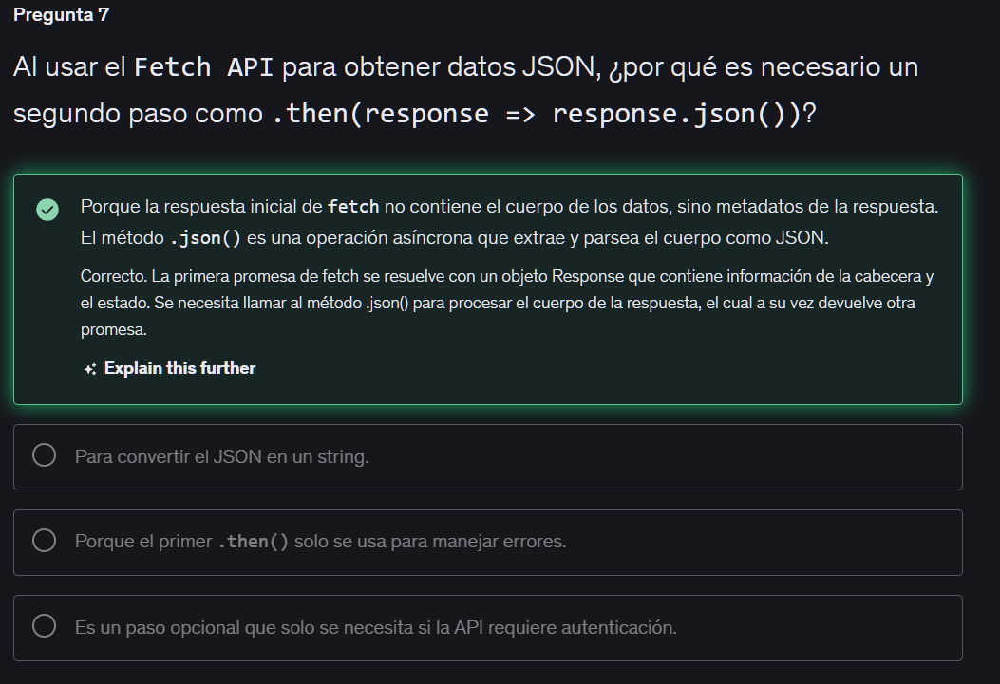
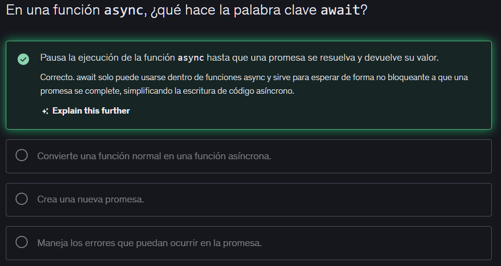
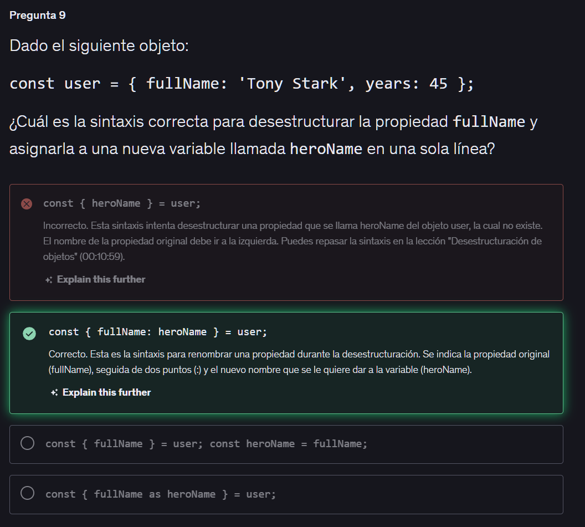
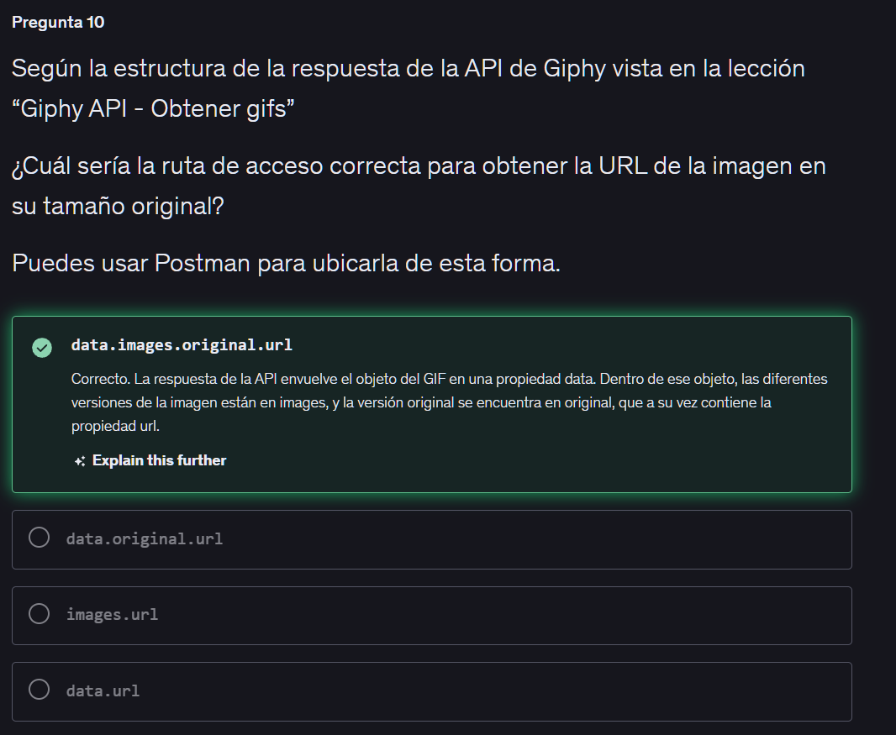

# SECCION 3: REFORZAMIENTO JAVASCRIPT/TYPESCRIPT

## 9. Introduccion

## 10. Temas puntuales

En esta sección estaremos teniendo nuestro reforzamiento sobre JavaScript moderno y TypeScript.

Pasaremos por los conceptos que necesito que dominemos antes de entrar de lleno a React.

Puntualmente aprenderemos sobre:

    Usar const, let y var correctamente.
    Escribir textos con template strings.
    Crear y usar interfaces en TypeScript.
    Trabajar con arreglos y recorrerlos.
    Definir funciones simples y complejas.
    Retornar múltiples valores desde funciones.
    Desestructurar objetos y arreglos.
    Usar enums para valores constantes.
    Importar y exportar módulos.
    Trabajar con promesas.
    Hacer peticiones con Fetch API.
    Usar la API de Giphy para obtener GIFs.
    Optimizar código con buenas prácticas.
    Escribir código asincrónico con async/await.
    Realizar tareas prácticas guiadas.

## 11. Inicio del proyecto - Reforzamiento

Para crear un proyecto en React usamos npm create vite, luego instalamos dependencias con npm i, y luego corremos el servidor con npm run dev

## 12. Explicación y estructura de directorios

**Servidor y Herramientas Básicas**

Servidor de desarrollo: Se levanta en la terminal ejecutando npm run dev y se detiene presionando Control + C.

**Estructura de Archivos:**

    - node_modules/: Almacena el código de todas las herramientas instaladas. Es extremadamente pesado (50-200MB+).
    - .gitignore: Lista los archivos (como node_modules) que Git debe ignorar para no subirlos a tu repositorio en GitHub.
    - index.html: Es el "cascarón" inicial. Aquí es donde TypeScript/React inyectará toda tu aplicación terminada.
    - package.json: El corazón del proyecto. Contiene los scripts (como dev o build) y el registro de todas tus dependencias.
    - package-lock.json: Un mapa técnico autogenerado que detalla las versiones exactas de node_modules. No debes editarlo manualmente.
    - tsconfig.json: Configuración de TypeScript. Está preconfigurado en modo estricto para obligarte a escribir buen código (detectando variables sin usar o tipos incorrectos).
    - public/: Carpeta para assets estáticos puros.
    - src/: Aqui es donde escribiras todo tu codigo

```typescript
import './style.css'
document.querySelector<HTMLDivElement>('#app')!.innerHTML = `
  <div>
    <h1>Hola Mundo</h1>
  </div>
`
```

## 13. Variables y constantes

**Declaración de Variables: const vs. let**

El principio fundamental es: Declara todo como const por defecto.

    - const: Cuando el valor no va a cambiar en el futuro. Es la mejor práctica. Es más ligero en memoria porque no necesita la configuración interna para cambiar su valor.
    - let: Solo cuando sabes que el valor necesitará reasignarse (ej. un contador que empieza en 0 y luego cambia a 3). Permite la mutación del dato manteniendo un alcance seguro.

El truco del console.log: Al imprimir variables para depurar, envuélvelas en llaves (ej. console.log({ firstName })). Esto imprimirá un objeto en la consola, mostrándote tanto el nombre de la variable como su valor.

**Los "Superpoderes" de TypeScript (Inferencia de Tipos)**

A diferencia de JavaScript puro, TypeScript analiza el código mientras lo escribes para prevenir errores. El superpoder principal es la inferencia de tipos: TypeScript adivina automáticamente qué tipo de dato es tu variable basándose en el valor que le asignas.

**Cómo infiere según la declaración:**

    Con let: Si declaras let lastName = "Herrera", TypeScript infiere que el tipo es string. Sabe que el valor puede cambiar, pero te obligará a que el nuevo valor siga siendo un texto.

    Con const: Si declaras const lastName = "Herrera", TypeScript infiere que el tipo es exactamente el valor "Herrera". Como es una constante, sabe que nunca podrá ser otra cosa.

**Prevención de Errores**

Si declaras let diceNumber = 5 (TypeScript infiere tipo number), y luego intentas asignarle un texto: diceNumber = "3", TypeScript te marcará un error en el editor: "El tipo string no es asignable al tipo de dato number".

(Nota: Aunque tu servidor de desarrollo local de Vite lo compile de todos modos, este tipo de errores harán que tu aplicación falle cuando intentes compilarla para producción).

```typescript
const firstName = "John";
const lastName = "Doe";

console.log(`Hello, ${firstName} ${lastName}!`);

const containsLetterH = lastName.includes("h");
console.log({ containsLetterH });

//En la consola me saldra un objeto con la propiedad containsLetterH y su valor sera false, ya que el apellido "Doe" no contiene la letra "h".
```

## 14. Template String

**Comillas y Caracteres de Escape**

En JavaScript/TypeScript, hay varias formas de definir un texto (string), y elegir la correcta te ahorra problemas con caracteres especiales:

    Comillas sencillas (' '): Es la convención y buena práctica general para textos simples (ej. 'Fernando').

    Comillas dobles (" "): Útiles cuando tu texto incluye un apóstrofe. Si usas comillas sencillas para la palabra 'O'Neil', el apóstrofe cerrará el string prematuramente y causará un error. Al usar "O'Neil", el problema se resuelve.

    Backslash o Carácter de Escape (\): Si necesitas usar comillas dobles dentro de un string que ya usa comillas dobles, debes "escaparlas" para que el código no se rompa (ej. "El apellido es \"O'Neil\""). El \ también se usa para saltos de línea (\n).

**Template Strings (La Solución Moderna)**

Los Template Strings utilizan el carácter backtick o acento grave (`). 
Ofrecen dos superpoderes fundamentales:

**A. Interpolación de Variables y Expresiones**
Puedes inyectar el valor de una variable directamente dentro del texto usando la sintaxis ${ ... }.


```typescript
// Usando Template Strings (Limpio y fácil de leer)
const fullName = `${firstName} ${lastName}`;
```

Dato Clave: Lo que va dentro de las llaves ${} es evaluado como una expresión de JavaScript. Esto significa que no solo puedes poner variables, sino también operaciones matemáticas (ej. ${1 + 1} imprimirá un 2).

**B. Strings Multilínea**

Los backticks respetan los espacios y los saltos de línea tal como los escribes en tu editor, sin necesidad de usar caracteres de escape (\n) ni concatenar con +.

```typescript
const ticket = `
  Nombre: ${firstName}
  Apellido: ${lastName}
`;
```

```typescript
const firstName = 'Nick'
// const lastName = '0\'Neill "es el apellido de mi padre"';
const lastName = "O' Neill";

const fullName = `
El nombre es: ${firstName} ${lastName}
`
console.log(fullName)
```

## 15. Objetos literales

Un objeto literal en JavaScript y TypeScript es, en términos sencillos, la forma directa de crear un objeto escribiendo sus datos explícitamente entre llaves { }.

Se le llama "literal" porque estás definiendo la estructura y los valores exactos literalmente en el texto de tu código, en lugar de construirlo usando funciones intermedias o clases.

Para entenderlo mejor, mira la diferencia entre crearlo de forma literal frente a la forma antigua (instanciando):

**1. Forma Literal (La que usarás el 99% del tiempo)**

Es inmediata, limpia y muy fácil de leer. Funciona como un diccionario con pares de "llave" (propiedad) y "valor":

```typescript
const ironman = {
  firstName: "Tony",  // Llave: Valor
  lastName: "Stark",
  age: 45
};
```

**2. Forma No Literal (Instanciando un constructor)**

Hace exactamente lo mismo, pero requiere más pasos y es mucho menos visual:

```typescript
const ironman = new Object();
ironman.firstName = "Tony";
ironman.lastName = "Stark";
ironman.age = 45;
```

**El Mito de const en los Objetos**

Cuando declaras un objeto literal con const, TypeScript bloquea la referencia en memoria, no el contenido del objeto.

    Permitido (Mutación): Puedes cambiar el valor de las propiedades internas libremente (ej. person.firstName = "Peter").

    Prohibido (Reasignación): No puedes igualar la variable a un valor primitivo ni a un objeto completamente nuevo (ej. person = 123 o person = { ... }). El espacio de memoria principal es inamovible.

**La Trampa de la Referencia**

El error más común en JavaScript es intentar hacer una copia asignando un objeto directamente a otra variable:

```typescript
const ironman = { firstName: "Tony", age: 45 };
const spiderman = ironman; // ¡PELIGRO! No es una copia.
```

En este escenario, spiderman e ironman apuntan exactamente al mismo espacio en la memoria. Si cambias spiderman.age = 22, la edad de ironman también será 22. Modificar uno, modifica al otro inevitablemente.

**Shallow Copy (El Operador Spread)**

Para romper esa referencia principal y crear variables separadas, usamos el operador spread (...). Esto extrae las propiedades de un objeto y las "esparce" dentro de unas nuevas llaves.

```typescript
const spiderman = { ...ironman };
```

El límite del Spread (La copia superficial): Esto solo hace una copia de primer nivel. Si tu objeto tiene otro objeto anidado adentro (como address: { city: "New York" }), la propiedad address se copiará, pero seguirá pasando como referencia. Es decir, si Spiderman cambia la ciudad de su dirección, la ciudad de Ironman también cambiará.

**Deep Copy (structuredClone)**

Cuando necesitas un clon absoluto (un clon profundo) donde tanto las propiedades principales como todos los objetos anidados sean completamente independientes, la solución moderna y nativa de JavaScript es structuredClone.

```typescript
const spiderman = structuredClone(ironman);
```

Esto rompe absolutamente todas las referencias de memoria, sin importar qué tan complejo o profundo sea el objeto original.

```typescript
const ironman = {
    firstName: 'Bruce',
    lastName: 'Wayne',
    age: 35,
};

ironman.firstName = 'Clark';
ironman.lastName = 'Kent';
ironman.age = 30;

console.log(ironman);
```

## 16. Interfaces de TypeScript

**El Problema de la Inferencia Libre**
Aunque TypeScript adivina el tipo de dato de las propiedades de un objeto literal, por defecto no te impide agregar propiedades que no deberían existir o reasignar tipos por error (ej. cambiar una edad de number a string reescribiendo la propiedad).

Para obligarte a ti y a tu equipo a respetar una estructura exacta, necesitas un "contrato": las Interfaces.

**¿Qué es una Interface?**

Es un molde que define exactamente qué propiedades debe tener un objeto y de qué tipo de dato debe ser cada una.

Convención: Los nombres de las interfaces siempre se escriben en UpperCamelCase (ej. Person, no person).

Propiedades Opcionales: Si quieres que una propiedad no sea obligatoria, le agregas un signo de interrogación ? antes de los dos puntos (ej. address?: Address).

El secreto de las Interfaces: No tienen una contraparte en JavaScript. Cuando TypeScript hace la transpilación (la traducción de código TS a JS), las interfaces desaparecen por completo. Puedes tener mil interfaces en tu archivo .ts y eso equivaldrá a cero líneas de código en tu archivo final .js.

**Composición de Interfaces (La Buena Práctica)**

Si un objeto tiene propiedades anidadas (como una dirección dentro de una persona), es una mala práctica definir todo el árbol dentro de una sola interfaz porque el código no escala bien.

La forma profesional de hacerlo es crear interfaces separadas y conectarlas:

```typescript
// 1. Defines las partes pequeñas primero
interface Address {
  postalCode: string;
  city: string;
}

// 2. Las integras mediante composición
interface Person {
  firstName: string;
  lastName: string;
  age: number;
  address?: Address; // Propiedad opcional que usa la otra interfaz
}

// 3. Creas el objeto aplicando el molde
const ironman: Person = {
  firstName: "Tony",
  lastName: "Stark",
  age: 45
  // address es opcional, así que no da error si falta
}
```

Si declaras una variable con un tipo de interfaz (ej. const spiderman: Person = {}), te marcará un error porque faltan propiedades. Si pones el cursor dentro de las llaves y presionas Control + . (o Cmd + . en Mac), puedes seleccionar "Añadir propiedades faltantes" (Add all missing properties) y el editor autocompletará la estructura por ti.

```typescript
interface Person {
    firstName: string;
    lastName: string;
    age: number;
    address: Address;
}

interface Address {
    postalCode: string;
    city: string;
}

const ironman: Person = {
    firstName: 'Bruce',
    lastName: 'Wayne',
    age: 35,
    address: {
        postalCode: '12345',
        city: 'Gotham'
    }
};

console.log(ironman);

```

## 17. Arreglos

**El Peligro de los Arreglos en JavaScript**

En JavaScript puro, un arreglo puede contener una mezcla de cualquier cosa: números, textos, booleanos y objetos, todo al mismo tiempo.

```typescript
// Esto es válido en JS, pero es una mala práctica:
const myArray = [1, 2, "texto", true, { name: "Tony" }];
```

Si accidentalmente mezclas tipos (por ejemplo, alguien escribe "4" en lugar de 4), JavaScript no te avisará. Si luego intentas hacer una suma matemática con ese arreglo, JavaScript concatenará el texto en lugar de sumar (ej. 4 + 10 = "410"), creando errores silenciosos difíciles de rastrear.

**Tipado de Arreglos en TypeScript**

Para evitar estos desastres, debes decirle explícitamente a TypeScript qué tipo de datos vivirá dentro del arreglo.

La sintaxis es: TipoDeDato[]

```typescript
// FORMA CORRECTA: Declarar el tipo explícitamente
const myArray: number[] = [1, 2, 3, 4, 5]; 

// Ahora TypeScript bloqueará cualquier intento de agregar un texto:
myArray.push("10"); // ❌ ERROR: El tipo string no es asignable a number
```

**Tipos Múltiples (Union Types)**

Si genuinamente necesitas que un arreglo acepte dos tipos distintos (por ejemplo, números y textos), debes declararlo usando un paréntesis y el operador de tubería | (que significa "o").

```typescript
const myArray: (number | string)[] = [1, 2, "tres", 4];
```

Regla de Oro: Nunca dejes que TypeScript adivine (infiera) el tipo de un arreglo vacío. Si declaras const myArray = [], TypeScript no sabe qué planeas poner dentro y le asignará el tipo any o never. Siempre declara el tipo: const myArray: number[] = [].

**Clonación de Arreglos (El problema de la referencia)**

Al igual que con los objetos literales, los arreglos se pasan por referencia en la memoria. Si igualas un arreglo a otro (array2 = array1), modificar el segundo afectará al primero.

Tienes dos formas de hacer una copia:

**El Operador Spread (...):**

Útil para arreglos de primitivos (solo números o solo textos).

```typescript
const array2 = [...myArray];
```

Advertencia: Si el arreglo contiene objetos por dentro (ej. [{ id: 1 }, { id: 2 }]), el spread no funcionará bien; los objetos internos seguirán enlazados por referencia.

**structuredClone (Clon Profundo):**

La forma más segura y recomendada si tienes arreglos complejos o arreglos de objetos.

```typescript
const array2 = structuredClone(myArray);
```

```typescript
const myArray: number[] = [1, 2, 3, 4, 5, 6];

const myArray2 = [...myArray];
// const myArray2 = structuredClone(myArray);

myArray2.push(7);

console.log({myArray, myArray2});
```

## 18. Funciones

**Funciones Tradicionales vs. Funciones de Flecha**

En JavaScript moderno y TypeScript, puedes crear funciones de dos maneras. Ambas son válidas y verás ambas a lo largo de los proyectos en React.

**Función Tradicional (function)**

Es la forma clásica. La palabra reservada function declara directamente la función.

```typescript
function greet(name: string): string {
  return `Hola ${name}`;
}
```

**Función de Flecha (Arrow Function)**

Es una forma más moderna. Técnicamente, estás creando una función anónima y asignándola a una variable constante (const).

```typescript
const greetTwo = (name: string): string => {
  return `Hola ${name}`;
}
```

**¿Cuál es la diferencia principal?**

    1. Protección de variable: Al usar const con la función de flecha, aseguras que el identificador (greetTwo) no pueda reasignarse accidentalmente a otra cosa en el futuro. Las funciones tradicionales sí permiten ser reescritas en JavaScript puro.

    2. El objeto this: Las funciones de flecha no alteran el contexto del objeto this (un tema avanzado de JS).

    3. Callbacks: Las funciones de flecha son mucho más limpias y legibles cuando necesitas pasar una función rápida como argumento a otra función (un callback).


**Tipado Estricto en Funciones (Contratos)**

TypeScript necesita saber dos cosas sobre tus funciones: qué reciben y qué devuelven.

**A. Tipar los Argumentos**

Debes especificar el tipo de dato que espera cada parámetro para evitar que otros desarrolladores le envíen basura.

    Ejemplo: En greet(name: string), si alguien intenta llamar a la función enviando un número (greet(123)), TypeScript arrojará un error antes de ejecutar el código.

**B. Tipar el Valor de Retorno**

Si no especificas qué devuelve la función, TypeScript lo inferirá leyendo tu return. Sin embargo, la buena práctica es definir explícitamente el tipo de retorno. Esto crea un "contrato": si dices que la función debe devolver un texto, TypeScript te marcará un error si accidentalmente devuelves un número u omites el return.

    Sintaxis: Se colocan los dos puntos (:) después de los paréntesis de los argumentos.
    Ejemplo: const greet = (name: string): string => { ... }


**Métodos vs. Funciones**

El profesor hizo una breve distinción conceptual importante durante la práctica:

Función: Es un bloque de código independiente (ej. getUser()).

Método: Es una función que vive dentro de un objeto (ej. El .log() dentro del objeto global console). A nivel técnico son lo mismo, pero se les llama métodos cuando pertenecen a un objeto.

```typescript
function greet(name: string): string {
    return `Hello, ${name}!`;
}

const greet2 = (name: string): string => {
    return `Hello, ${name}!`;
}

const message = greet("Alice");
const message2 = greet2("Bob");

console.log(message, message2);

function getUser () {
    return {
        uid: 'ABC-123',
        username: 'nick'
    };
}

const getUser2 = () => {
    return {
        uid: 'ABC-456',
        username: 'loco'
    }
}

const user = getUser();
const user2 = getUser2();

console.log(user, user2);
```

## 19. Funciones con multiples retornos

**1. Retornos Implícitos en Funciones de Flecha**

La regla de oro: si tu función de flecha solo hace una cosa (retornar un valor), puedes omitir las llaves {} y la palabra reservada return.

El caso especial de los Objetos Literales:
Cuando intentas retornar un objeto implícitamente, JavaScript confunde las llaves del objeto {} con las llaves del cuerpo de la función. Para solucionarlo, debes envolver el objeto entre paréntesis ().

```typescript
// ❌ Incorrecto: JS cree que es el cuerpo de la función y falla
const getUser = (uid: string) => { userId: uid, userName: 'Admin' }

// ✅ Correcto: Los paréntesis indican un retorno implícito del objeto
const getUser = (uid: string) => ({ userId: uid, userName: 'Admin' })
```

**2. Tipado Estricto e Interfaces (TypeScript)**

Evita el any implícito: Si no defines el tipo de un parámetro, TypeScript le asigna any por defecto y en modo estricto marcará error. Siempre define qué esperas recibir.

Interfaces vs. Clases: Una interface en TypeScript solo dicta cómo luce un objeto (su forma o contrato), pero no fuerza comportamiento ni implementa lógica como lo hace una clase.

```typescript
interface User {
  userId: string;
  userName: string;
}

// Ahora TypeScript sabe exactamente qué estructura tiene el objeto retornado
const getUser = (uid: string): User => ({ userId: uid, userName: 'Admin' });
```

**3. ¿Funciones de Flecha o Tradicionales?**

No hay una regla escrita en piedra, pero la convención sugerida en la clase es:

Funciones de Flecha: Úsalas como tu estándar por defecto en casi todo el código, especialmente para callbacks anónimos (como dentro de un .map() o .forEach()).

Funciones Tradicionales (function): Resérvalas para helpers o utilidades a nivel superior (top-level) en archivos independientes, donde la legibilidad inmediata de "esto es una función" sea tu prioridad.

**4. El "ProTip": Pasar Referencias de Funciones**

Cuando tienes un callback cuya única tarea es tomar los argumentos y pasarlos exactamente igual a otra función, puedes omitir la función anónima y simplemente pasar la referencia de la función destino.

```javascript
const myNumbers = [1, 2, 3, 4, 5];

// Versión larga (Callback estándar)
myNumbers.forEach((value) => console.log(value));

// Versión Pro (Pasar la referencia)
myNumbers.forEach(console.log);
```

**¿Que es un callback?**

Imagina un callback con esta situación cotidiana:

Vas a un restaurante muy concurrido. Pides una mesa y el recepcionista te dice: "No tenemos lugar ahora, pero déjeme su número y lo llamaremos de vuelta cuando su mesa esté lista".

Ese "te llamaremos de vuelta" (call you back en inglés) es exactamente lo que hace un callback en programación.

En términos de código: Un callback es simplemente una función que le pasas como parámetro a otra función, con la instrucción de que la ejecute más tarde (por ejemplo, cuando termine de hacer otra tarea o ocurra un evento).

**¿Cómo se ve en código?**

En la clase que acabas de repasar, el profesor hizo exactamente esto con el método .forEach().

```js
const myNumbers = [1, 2, 3];

// Aquí le pasamos una función de flecha al forEach.
// Esa función de flecha ES el callback.
myNumbers.forEach((numero) => {
  console.log(numero);
});
```

Le estás diciendo a forEach: "Oye, recorre esta lista de números y, por cada uno, ejecuta esta función que te estoy dando".

**Un ejemplo hecho a mano**

Para que veas cómo funciona por dentro, imagina que tú creas la función que recibe el callback:

```js
// 1. Esta es una función normal
function saludar(nombre) {
  console.log("¡Hola, " + nombre + "!");
}

// 2. Esta función recibe OTRA función como parámetro (el callback)
function prepararSaludo(funcionCallback) {
  const nombreUsuario = "Nico"; 
  
  // Aquí es donde "llamamos de vuelta" a la función que nos pasaron
  funcionCallback(nombreUsuario); 
}

// 3. Usamos la función principal y le pasamos 'saludar' como callback
prepararSaludo(saludar);
```

**¿Por qué son tan importantes en JavaScript y React?**

JavaScript es muy impaciente; no le gusta quedarse esperando. Si tu aplicación necesita descargar la foto de un perfil desde un servidor, eso toma unos segundos. JavaScript no va a congelar toda la pantalla esperando.

En su lugar, usa un callback que dice: "Empieza a descargar la foto. Yo seguiré cargando el resto de la página. Cuando termines, ejecuta este callback para mostrar la imagen".

```typescript
function greet(name: string): string {
    return `Hello, ${name}!`;
}

const greet2 = (name: string) =>  `Hello, ${name}!`;

const message = greet("Alice");
const message2 = greet2("Bob");

console.log(message, message2);

interface User {
    uid: string;
    username: string;
}

function getUser (): User {
    return {
        uid: 'ABC-123',
        username: 'nick'
    };
}

const getUser2 = () => ({    
        uid: 'ABC-456',
        username: 'loco'    
});

const user = getUser();
const user2 = getUser2();

console.log(user, user2);

const myNumbers: number[] = [1, 2, 3, 4, 5];

myNumbers.forEach((value) => console.log({value}));

// Otra forma de escribirlo sería:
// myNumbers.forEach(function(value) {
//     console.log({value});
// })
```

## 20. Desestructuración de objetos

**1. El Concepto Base: Desarmar Objetos**

La desestructuración consiste en "desarmar" un objeto para extraer sus propiedades y guardarlas en variables individuales usando una sola línea de código. En los objetos, el orden en el que extraes las propiedades no importa.

```typescript
const person = { name: 'Tony', age: 45, key: 'Iron Man' };

// ❌ Forma tradicional (repetitiva)
const name = person.name;
const age = person.age;

// ✅ Con desestructuración (limpio y directo)
const { name, age, key } = person;
```

**2. Valores por Defecto y Renombramiento**

Cuando desestructuras, puedes encontrarte con dos problemas comunes: que la propiedad no exista (o sea opcional), o que el nombre de la variable ya esté en uso en tu archivo.

Valores por defecto (=): Si una propiedad (como rank) es opcional y viene como undefined, puedes asignarle un valor de respaldo.

Renombrar variables (:): Si ya tienes una variable name en tu código y quieres evitar un choque de nombres, puedes rebautizar la propiedad al extraerla.

```typescript
// Extraemos 'rank' con un valor por defecto, y renombramos 'name' a 'ironmanName'
const { rank = 'sin rango', name: ironmanName } = person;
```

**3. Desestructuración en Argumentos de Funciones**

En lugar de recibir el objeto completo y desestructurarlo adentro, puedes hacerlo directamente en los paréntesis de la función. Esto será el estándar cuando trabajes con Props en los componentes de React.

```typescript
interface Hero { name: string; age: number; rank?: string; }

// En lugar de: function useContext(hero: Hero) { ... }
function useContext({ name, age, rank }: Hero) {
  // Aquí ya puedes usar name, age y rank directamente
}
```

El atajo de los Objetos Literales: Si vas a crear un objeto donde el nombre de la propiedad o llave es exactamente igual al nombre de tu variable, JavaScript te permite escribirlo una sola vez. Es decir, en lugar de retornar { age: age }, simplemente retornas { age }.

**4. Desestructuración Anidada (La Regla de Oro)**

Si una función te retorna un objeto que tiene otros objetos adentro (como un user que dentro tiene un name), es posible extraer las propiedades profundas en una sola línea. Sin embargo, la recomendación es no hacerlo porque sacrifica mucha legibilidad.

```typescript
// ❌ Posible, pero confuso de leer:
const { user: { name } } = context;

// ✅ Mejor práctica: Desestructura en dos pasos para mantener el código claro:
const { user } = context;
const { name } = user;
```

```typescript
const person = {
    name: 'John',
    age: 30,
    key: 'Ironman'
};

const { name, age, key } = person;

console.log({name, age, key});

interface Hero {
    name: string;
    age: number;
    key: string;
    rank?: string;
}

const useContext = ({ name, age, key, rank }: Hero) => {
    return {
        keyName: key,
        user: {
            name: name,
            age: age,
        },
        rank: rank
    }
}

const context = useContext(person);

const { keyName, user:{name: userName}, rank } = useContext(person);

console.log(context);

console.log({keyName, userName, rank});
```

## 21. Desestructuración de arreglos

**1. La Regla de Oro: Posición vs. Nombre**

La diferencia principal entre desestructurar objetos y arreglos radica en cómo JavaScript identifica lo que quieres extraer.


| Característica         | Objetos `{}`                        | Arreglos `[]`                        |
|-----------------------|-------------------------------------|--------------------------------------|
| Sintaxis              | Llaves `{}`                         | Corchetes `[]`                       |
| Identificador         | Por el nombre de la propiedad       | Por la posición (índice)             |
| Nombre de variables   | Debe coincidir (o usar `:` para renombrar) | Puedes inventar el nombre que quieras |
| Importancia del orden | No importa                          | Es estrictamente obligatorio         |

```typescript
const characterNames = ['Goku', 'Vegeta', 'Trunks'];

// El primer valor extraído siempre será 'Goku', sin importar cómo llames a la variable
const [p1, p2, p3] = characterNames;
```

**2. Omitir Elementos (El truco de las comas)**

Si tienes un arreglo con varios elementos, pero solo te interesa extraer uno que está al final, no necesitas crear variables basura (como p1 o _) para rellenar los espacios. Simplemente dejas el espacio vacío usando comas ,.

```typescript
// No nos interesa ni la posición 1 ni la 2, solo queremos a Trunks
const [, , trunks] = characterNames;
```

Nota: Aunque es totalmente válido, dejar muchos espacios en blanco (ej. [,,,, valor]) puede ser difícil de leer. Si el arreglo es muy grande, a veces es mejor acceder por el índice directamente (array[4]).

**3. Desestructuración de Funciones y el poder de as const**

Es muy común tener funciones que retornan arreglos. Sin embargo, en TypeScript, si retornas un arreglo con diferentes tipos de datos, pierdes la precisión del tipado estricto a menos que intervengas.

El Problema:
Si retornas ['ABC', 123], TypeScript infiere que el arreglo es de tipo (string | number)[]. Es decir, cree que cualquier posición puede ser texto o número, lo cual es peligroso si intentas sumar o concatenar esos valores más adelante.

La Solución: as const
Al agregar as const al final del retorno, le dices a TypeScript: "Este arreglo es de solo lectura y sus posiciones nunca van a cambiar de tipo". Convierte el arreglo en una Tupla estricta.

```typescript
// Al usar "as const", TypeScript congela la estructura
const returnsArrayFn = () => {
  return ['ABC', 123] as const; 
}

// Ahora al desestructurar:
const [letters, numbers] = returnsArrayFn();

// TS sabe al 100% que 'letters' es un string y 'numbers' es un number.
```

```typescript
const characterNames = ['Goku', 'Vegeta', 'Trunks'];

const [,,p3] = characterNames;

console.log({p3});

const returnsArrayFn = () => {
    return ['ABC', 123] as const;
};

const [letters, numbers] = returnsArrayFn();

console.log({letters, numbers});
```

## 22. Tarea - Desestructuración

# 🧠 Tarea: Implementar `useState`

Crea una función llamada `useState`. Debe cumplir con los siguientes requisitos:

## Requisitos

- La función debe llamarse `useState`.
- Debe **retornar un arreglo con dos elementos**:

  #1 - Un string (el valor inicial).
  
  #2 - Una función anónima de flecha que:
     - Recibe un string.
     - Imprime ese string en consola.

## Ejemplo de uso esperado

```js
const [name, setName] = useState('Goku');
console.log(name);       // Goku
setName('Vegeta');       // Imprime "Vegeta"
```

## 🛠️ Tips
No olvidar usar `as const` para decir que siempre regresará una estructura predefinida el arreglo.

**1. La Solución del Ejercicio**

El objetivo era crear una función que imitara la firma de retorno del Hook useState de React, utilizando TypeScript y desestructuración de arreglos.

```typescript
// 1. Definición de la función
const useState = (value: string) => {
  return [
    value, 
    (newValue: string) => { console.log(newValue); }
  ] as const; // <-- ¡La pieza clave de TypeScript!
};

// 2. Uso y desestructuración del arreglo
const [name, setName] = useState('Goku');

// 3. Pruebas
console.log(name);     // Imprime: Goku
setName('Vegeta');     // Imprime: Vegeta
```

**2. Conceptos Clave Aplicados**

**El poder de as const (Tuplas estrictas)**: Sin el as const, TypeScript mira el arreglo de retorno [value, funcion] e infiere que tienes un arreglo mixto: (string | Function)[]. Esto significa que creería que la primera posición podría ser una función, y la segunda posición podría ser un texto.

Al agregar as const, conviertes ese arreglo en una Tupla estricta de solo lectura. Le dices a TypeScript:

"La posición 0 siempre será un string."

"La posición 1 siempre será una función."

Gracias a esto, cuando intentas ejecutar setName('Vegeta'), TypeScript sabe con 100% de seguridad que setName es una función válida y no lanzará errores.

**El tipo de retorno void:** Si pasas el cursor sobre tu función useState en tu editor, verás que la función interna tiene la firma (newValue: string) => void.
En TypeScript, void significa explícitamente que la función ejecuta instrucciones (como imprimir en consola) pero no devuelve ningún valor (en la práctica de JS, retorna undefined, pero void le indica a TS que no esperas usar ese retorno para nada).

**Nombres arbitrarios al desestructurar**: Cuando haces const [name, setName] = useState('Goku'), los nombres name y setName te los inventaste tú en ese momento. Dado que la desestructuración de arreglos se basa en la posición y no en el nombre de la llave (como en los objetos), puedes llamar a estas variables como mejor se adapte a tu código (ej. [jugador, setJugador]).


```typescript
const useState = (value: string) => {
    return [value, (newValue: string) => {
        console.log({newValue});
    },] as const;
}

const [name, setName] = useState('Goku');

console.log({name});
setName('Vegeta');
```

## 23. Interfaces y Enumeraciones

**1. Tipado Estricto de Arreglos**

Cuando importas o creas un arreglo de datos (como una lista de superhéroes), TypeScript intenta inferir los tipos automáticamente. Sin embargo, para evitar errores (como mezclar números y textos donde no van), la mejor práctica es definir la estructura explícitamente y asignar ese tipo al arreglo.

```typescript
// 1. Defines cómo luce un elemento
interface Hero {
  id: number;
  name: string;
  owner: string;
}

// 2. Le indicas a TypeScript que la variable es un arreglo de ese tipo
const heroes: Hero[] = [ ... ];
```

**2. Restringir Valores Permitidos**

Si una propiedad solo puede aceptar un conjunto muy específico de valores (por ejemplo, que el owner solo sea "DC" o "Marvel"), dejarlo como un simple string es peligroso porque permitiría valores inválidos como "DC2" o "Marvell".

Tienes dos herramientas principales para solucionar esto:

**Opción A: Tipos Literales (type)**

Creas un tipo que sea una unión de los strings exactos permitidos.

```typescript
type Owner = 'DC' | 'Marvel';
// Uso: owner: 'DC'
```

Ventaja: Al escribir, el editor te autocompleta las opciones exactas.

Característica: Se asigna directamente el string literal.

**Opción B: Enumeraciones (enum)**

Crea una estructura de datos que agrupa constantes bajo un mismo nombre.

```typescript
enum Owner {
  DC = 'DC',
  Marvel = 'Marvel'
}
// Uso: owner: Owner.DC
```

Cuidado con los valores por defecto: Si no le asignas explícitamente un valor de tipo string (='DC'), TypeScript le asignará valores numéricos secuenciales (0, 1, 2...). Esto es peligroso al interactuar con bases de datos o APIs, ya que terminarías guardando un 0 en lugar de "DC".

**3. El Impacto en la Transpilación (TypeScript ➡️ JavaScript)**

Esta es la diferencia más importante a nivel de arquitectura y peso de tu aplicación final:


| Estructura  | Propósito Principal                                 | ¿Genera código en el JS final?                                      |
|-------------|-----------------------------------------------------|---------------------------------------------------------------------|
| interface   | Definir la forma/estructura de un objeto.           | ❌ No. Desaparece tras compilar. Solo existe en TS.                 |
| type        | Restringir valores o crear uniones/alias.           | ❌ No. Desaparece por completo.                                     |
| enum        | Agrupar constantes.                                 | ✅ Sí. TypeScript lo convierte en un objeto literal real en JavaScript. |

Conclusión práctica: Usar type o interface no añade ni un solo byte de peso a tu aplicación final (JavaScript). Usar enum sí crea código real, lo cual es útil si necesitas iterar sobre esos valores en tiempo de ejecución, pero añade una fracción mínima de peso a tu bundle.

```typescript
// type Owner = 'DC' | 'Marvel';

enum Owner {
    DC = 'DC', //0 //'DC'
    Marvel = 'Marvel', //1 //'Marvel'
}

interface Hero {
    id: number;
    name: string;
    owner: Owner;
}

const heroes: Hero[] = [
  {
    id: 1,
    name: 'Batman',
    owner: Owner.DC,
  },
  {
    id: 2,
    name: 'Spiderman',
    owner: Owner.Marvel,
  },
  {
    id: 3,
    name: 'Superman',
    owner: Owner.DC,
  },
  {
    id: 4,
    name: 'Flash',
    owner: Owner.DC,
  },
  {
    id: 5,
    name: 'Wolverine',
    owner: Owner.Marvel,
  },
  {
    id: 6,
    name: 'Iron Man',
    owner: Owner.Marvel,
  }
]; 
```

## 24. Importaciones y exportaciones

La lección se centra en la modularización del código y la seguridad de tipos, tomando como caso práctico la creación de una función llamada getHeroById que busca información dentro de un arreglo de datos.

La clase se centra en enseñar la modularidad en TypeScript a través de importaciones y exportaciones. El objetivo práctico es crear una función llamada getHeroById que busque un héroe específico en un arreglo de datos. Para evitar duplicar código (aplicando el principio DRY: Don't Repeat Yourself), el instructor demuestra cómo exportar arreglos e interfaces desde otros archivos y cómo manejarlos correctamente, aplicando un tipado estricto para controlar escenarios donde el héroe buscado no exista.

**1. Módulos y el Principio DRY**

El instructor plantea que copiar y pegar el arreglo de héroes en el nuevo archivo es una mala práctica. En JavaScript y TypeScript, cualquier archivo que exporta algo (una variable, función, clase o interfaz) se convierte automáticamente en un módulo.

**2. Tipos de Exportación e Importación**

Se discuten las dos formas principales de compartir código entre archivos:

Exportación Nombrada (Independiente): Usando export const heroes = [...]. Al importar, debes usar el nombre exacto dentro de llaves: import { heroes } from './data/heroes'. Si hay un conflicto de nombres en el archivo destino, puedes usar un alias con la palabra as (ej. import { heroes as misSuperHeroesFavoritos }). El instructor prefiere este método porque hace que el código sea más explícito y legible.

Exportación por Defecto: Usando export default heroes. Esto permite que quien importa el archivo le asigne el nombre que quiera inmediatamente sin usar llaves: import misSuperHeroesFavoritos from './data/heroes'.

**3. Importación de Tipos (Pro Tip de Rendimiento)**

Para que la función sepa cómo luce un "héroe", necesitan importar la interfaz Hero. Aquí el instructor da un consejo avanzado: usar la palabra clave type al importar interfaces.

Sintaxis: import type { Hero } from './data/heroes'

¿Por qué hacerlo? Esto le indica al transpilador que Hero es solo una definición estructural para tiempo de desarrollo. Al compilar a JavaScript, esa importación se elimina por completo, optimizando la velocidad y el peso del código final.

**4. La Función .find() y el Tipado de Retorno**

Para construir la lógica de getHeroById, se utiliza el método de arreglos .find(), el cual itera sobre los elementos y devuelve el primero que cumpla con la condición (que el ID coincida).

Aquí es donde entra la potencia de TypeScript:

  - Inferencia vs. Declaración: Si no le dices a la función qué va a retornar, TypeScript intenta adivinarlo. Es una mejor práctica declarar explícitamente el tipo de retorno.

  - Manejo de "Undefined" (Union Types): ¿Qué pasa si pasas el ID 7 y no existe ningún héroe con ese ID? El método .find() devolverá undefined. Para manejar esto de forma segura, el instructor declara que la función puede retornar dos cosas usando la unión de tipos: Hero | undefined.

  - Alternativa de Error: El instructor menciona que otra opción es lanzar un error (throw new Error('no existe...')) si no se encuentra el héroe, pero decide quedarse con el retorno de undefined para mantener la firma de la función clara, dejando el manejo de errores complejos para futuras clases con Promesas.

Al final, probar la función con distintos IDs en el archivo main.ts confirma que la lógica funciona a la perfección, devolviendo los datos correctos o undefined cuando corresponde, y todo bajo un estricto control de tipos.

**CODIGO DE CLASE**

```typescript
import {heroes, type Hero} from '../data/heroes.data';

const getHeroById = (id:number): Hero | undefined => {
    const  hero = heroes.find((hero) => {
        return hero.id === id;
    });
    // if (!hero) {
    //     throw new Error(`No existe un hero con el id ${id}`);
    // }
    return hero;
}

console.log(getHeroById(1));
```

## 25. Tarea - Importacion y exportación

// Tarea

// getHeroesByOwner => Hero[]
// Filtra heroes por su propietario
// @param Owner - El propietario por el cual filtrar(DC o Marvel)
// @returns Array de heroes pertenecientes al propietario
// En main.ts usaremos esta función

```typescript
export const getHeroesByOwner = (owner: Owner): Hero[] => {
    const filteredHeroes = heroes.filter((hero) => {
        return hero.owner === owner;
    });

    return filteredHeroes;
}

//En el archivo main.ts
import { getHeroesByOwner } from './bases/08-imp-exp'
import { Owner } from './data/heroes.data';

console.log(getHeroesByOwner(Owner.Marvel));
```

## 26. Promesas

La clase introduce el concepto de Promesas en JavaScript mediante la analogía de prestarle dinero a un amigo, donde existen tres escenarios posibles: el amigo te paga (éxito), el amigo desaparece (fracaso), y la vida continúa sin importar qué haya pasado (final). A través de código, el instructor demuestra cómo crear una promesa desde cero utilizando new Promise, simular un retraso en el tiempo con setTimeout, y manejar los resultados utilizando los métodos .then(), .catch(), y .finally(). Además, se introduce el concepto de Genéricos en TypeScript para tipar fuertemente el valor de retorno de la promesa.

**1. ¿Qué es una Promesa?**

Una promesa es un objeto en JavaScript que representa la eventual finalización (o fallo) de una operación asíncrona. Sirve para ejecutar tareas que toman tiempo (como ir al servidor a traer datos de los cursos que ofrecerás) sin bloquear el resto de la aplicación.

La analogía del instructor es perfecta:

  - La Tarea: Prestar $100 y esperar que te los paguen mañana.
  - El Éxito (resolve): El amigo te paga los $100.
  - El Fracaso (reject): El amigo se da a la fuga.
  - El Desenlace (finally): Sigues con tu vida, con o sin el dinero.

**2. Anatomía de una Promesa (Creación)**

Para crear una promesa, se utiliza la clase nativa Promise.

```typescript
const myPromise = new Promise((resolve, reject) => {
    // Cuerpo de la promesa: Tarea asíncrona
    setTimeout(() => {
        resolve(100); // Éxito
        // reject('Mi amigo se perdió'); // Fracaso
    }, 2000);
});
```

La función "Callback": Al crear una promesa, le pasamos una función que se ejecuta inmediatamente. Esta función define la tarea asíncrona (simulada aquí con un setTimeout de 2 segundos).

resolve (Éxito): Es una función que llamamos cuando la tarea se completó correctamente. Al llamarla, le pasamos el valor que queremos devolver (ej. los $100).

reject (Fracaso): Es una función que llamamos si algo sale mal. Usualmente se le pasa un mensaje de error o la "razón" del fallo.

**3. Consumir la Promesa (Manejo de Resultados)**

Una vez creada la promesa, necesitamos decirle a la aplicación qué hacer cuando termine. Esto se logra encadenando tres métodos principales:

  .then() (Entonces...): Se ejecuta solo si la promesa llama a resolve(). Recibe el valor exitoso (el dinero).

  .catch() (Atrapar...): Se ejecuta solo si la promesa llama a reject(). Sirve para manejar el error de forma segura y evitar que la aplicación colapse.

  .finally() (Finalmente...): Se ejecuta siempre, sin importar si la promesa fue un éxito o un fracaso. Es útil para hacer limpieza, como ocultar un icono de "cargando".

```typescript
myPromise
    .then( (myMoney) => { console.log('Tengo mi dinero:', myMoney); } )
    .catch( (reason) => { console.warn(reason); } )
    .finally( () => { console.log('A seguir con mi vida'); } );
```

**4. Tipado de Promesas con Genéricos en TypeScript**

El instructor menciona un problema: por defecto, TypeScript no sabe qué devuelve la promesa, asignándole el tipo unknown (desconocido).

Para arreglarlo y mantener un código seguro, se utilizan los Genéricos (los símbolos < >). Esto le permite a la promesa saber exactamente qué tipo de dato debe devolver.

```typescript
// Le decimos explícitamente que la promesa resolverá un número
const myPromise = new Promise<number>((resolve, reject) => { ... });
```

Al hacer esto, cuando usas el .then( (myMoney) => ... ), TypeScript ya sabe automáticamente que la variable myMoney es de tipo number, previniendo errores futuros. El instructor desaconseja tipar la variable directamente dentro del .then ("unsafe assignment") porque puede desincronizarse si la promesa cambia en el futuro.

**CODIGO DE LA CLASE**

```typescript
const myPromise = new Promise<number>((resolve, reject) => {
    setTimeout(() => {
        // resolve(100);
        reject('Error: No se pudo obtener el dinero');
    }, 2000);
});

myPromise
.then((myMoney) => {
    console.log(`Tengo mi dinero: ${myMoney}`);
})
.catch((reason) => {
    console.warn(reason);
})
.finally(() => {
    console.log('Pues a seguir trabajando');
});
```

## 27. Giphy API - Obtener gifs

El objetivo principal de esta clase es preparar el terreno para practicar peticiones HTTP (usando Fetch API y Promesas). Para ello, el instructor te guía en la creación de una cuenta en Giphy Developers para obtener una "API Key" gratuita. Luego, utilizan la herramienta Postman para hacer una petición real al endpoint de GIFs aleatorios de Giphy. Finalmente, analizan la enorme respuesta en formato JSON que devuelve el servidor, preparándote para un truco en la siguiente clase sobre cómo convertir toda esa información en interfaces de TypeScript sin tener que escribir cada línea a mano.

**1. El API de Giphy y el "API Key"**

Una API (Interfaz de Programación de Aplicaciones) es como un puente que te permite "hablar" con los servidores de Giphy para pedirles datos (en este caso, GIFs).

¿Para qué sirve el API Key? Los servidores no le dan datos a cualquiera que se los pida; necesitan saber quién eres. El API Key es como tu gafete de identificación o contraseña única. Al enviarlo en tu petición, Giphy sabe que es tu aplicación ("React Curso") la que está solicitando la información y puede llevar un control de cuántas peticiones haces.

**2. Pruebas con Postman y Query Parameters**

Postman es una herramienta fundamental para cualquier desarrollador web.  Sirve para simular peticiones a servidores sin necesidad de escribir código en tu aplicación todavía.

El Endpoint: Es la URL específica a la que vas a golpear para pedir algo puntual. En este caso, el endpoint de Giphy para un GIF aleatorio.

Query Parameters (Parámetros de consulta): En la URL de Postman, viste que se agregó un símbolo de interrogación ? seguido de api_key=TU_LLAVE. Estos son parámetros que viajan directamente en la URL para darle instrucciones o información extra al servidor (en este caso, tus credenciales).

**3. Análisis de la Respuesta (El JSON)**

Cuando haces clic en "Send" en Postman, el servidor te responde con un objeto gigante en formato JSON (JavaScript Object Notation).  Esta es la forma estándar en la que los servidores y los clientes web intercambian datos hoy en día.

El instructor se detiene a analizar la "anatomía" de esta respuesta:

Viene un objeto principal que contiene una propiedad llamada data.

Dentro de data, vienen un montón de propiedades en forma de strings (textos) y numbers (números), como el id, el type, y la url.

También hay un objeto anidado llamado images, el cual contiene el mismo GIF en múltiples resoluciones (downsized, original, etc.). Cada una de estas resoluciones tiene su propia altura (height), anchura (width) y la URL directa a la imagen animada.

**4. El Reto del Tipado Estricto (Preparación para la siguiente clase)**

Aquí es donde TypeScript entra en juego y donde la clase te deja un "cliffhanger".

Si recuerdas las clases anteriores, a TypeScript le gusta saber exactamente qué forma tienen los objetos (usando interfaces). Para trabajar de forma segura con la respuesta de Giphy en tu código de React, necesitas crear una interfaz que describa este objeto gigante.

El problema es que escribir manualmente una interfaz para las decenas de propiedades que devuelve Giphy (el id, url, is_sticker, las diferentes resoluciones en images, etc.) sería un dolor de cabeza y tomaría muchísimo tiempo. Por eso el instructor te pide que dejes Postman abierto; en la siguiente clase te enseñará una herramienta o atajo para leer ese JSON y generar la interfaz de TypeScript de forma automática en segundos.

## 28. Fetch API

El instructor demuestra cómo utilizar la función nativa fetch de JavaScript para realizar una petición a la API de Giphy. A través del manejo de Promesas, se extrae la respuesta inicial y se convierte de un flujo de datos (readable stream) a un objeto JSON. Finalmente, se navega por ese objeto para obtener la URL del GIF y se inserta dinámicamente en el documento HTML utilizando manipulación del DOM. La clase concluye evidenciando lo frágil que es trabajar con objetos de tipo any sin autocompletado, preparando el escenario perfecto para implementar interfaces de TypeScript.

**1. La función fetch() y la Petición HTTP**

fetch es la herramienta moderna integrada en los navegadores para hacer peticiones de red.

Al pasarle la URL (con tu constante API_KEY interpolada), fetch inicia la solicitud y retorna una Promesa.

Esta promesa se resolverá cuando el servidor de Giphy responda, ya sea con éxito (código de estado 200) o con un error (como un 404 de no encontrado).

**2. El primer .then() y el "Readable Stream"**

Cuando la promesa de fetch se resuelve con éxito, no te entrega directamente el texto JSON listo para usar. Te entrega un objeto de tipo Response.

El cuerpo (body) de esta respuesta viene en un formato llamado Readable Stream (flujo de datos de lectura). Esto es supereficiente para descargar archivos grandes progresivamente, pero no es un objeto que puedas leer directamente con código.

Para procesarlo y convertirlo en un objeto de JavaScript, se debe utilizar el método response.json(). Sin embargo, este proceso de transformación toma unos milisegundos, por lo que este método también retorna una nueva Promesa.

**3. Promesas en Cadena (Chaining)**

Para procesar esa segunda promesa sin crear un código desordenado (evitando anidar un .then() dentro de otro), se utiliza el encadenamiento:

En el primer .then(), simplemente haces un return response.json().

Al retornar una promesa, el siguiente .then() en la cadena automáticamente espera a que ese proceso termine.

En este segundo .then(), la variable que recibes (que el instructor bautiza como data) ya es el objeto puro y procesado, listo para consumirse.

**4. El problema del tipo any y la ruta data.data.images...**

Aquí surge el "dolor" principal que el instructor quiere que notes. TypeScript no tiene idea de qué hay dentro de la respuesta de Giphy, por lo que asume que es de tipo any.

Al intentar acceder a la imagen, la ruta queda así: data.data.images.original.url.

El primer data es el nombre de la variable en tu .then(). El segundo data es la propiedad principal que el servidor de Giphy envía dentro de su JSON.

Como el objeto es any, tu editor de código no sabe qué propiedades existen. Si escribes image en lugar de images, no te marcará error, pero la aplicación colapsará en tiempo de ejecución. Esta es exactamente la razón por la que en ingeniería de software con TypeScript se exige tipar las respuestas de las APIs.

**5. Manipulación del DOM**

Finalmente, con la URL de la imagen extraída, se usa JavaScript puro para dibujarla en pantalla:

  - document.createElement('img'): Crea una etiqueta  virtual en la memoria.
  - Se le asigna la propiedad src apuntando a la URL del GIF.
  - document.body.append(imgElement): Inserta físicamente esa etiqueta en el cuerpo de tu página web para que el navegador la renderice a la vista del usuario.

```typescript
const API_KEY = 'T61tYAY3LWDetn7eCIjvIXuUCvV2CB55';

const myRequest = fetch (`https://api.giphy.com/v1/gifs/random?api_key=${API_KEY}`);

myRequest
.then((response) => response.json())
.then((data) => {
    const imageUrl = data.data.images.original.url;
    console.log(imageUrl);

    const imgElement = document.createElement('img');
    imgElement.src = imageUrl;
    document.body.append(imgElement);
})
.catch((err) => {
    console.error(err);
});
```

## 29. Interfaces y optimización

El objetivo central de esta clase es eliminar el uso del tipo any al recibir respuestas de una API. Para evitar escribir a mano las interfaces de la compleja respuesta de Giphy, el instructor utiliza una extensión de Visual Studio Code ("Paste JSON as Code") que genera automáticamente todas las interfaces necesarias a partir de los datos copiados del portapapeles.
Una vez aplicado el tipado estricto, se soluciona el confuso problema de usar data.data mediante la desestructuración de objetos. Finalmente, se aplica un principio básico de Clean Code (Principio de Responsabilidad Única) separando la lógica que manipula el DOM en una función independiente, dejando la promesa exclusivamente para manejar la petición HTTP.

**1. El problema de any y la generación automática de Interfaces**

Como viste en la clase anterior, cuando usas fetch, TypeScript no sabe qué devuelve el servidor y lo clasifica como any. Esto significa que pierdes el autocompletado y el compilador confía ciegamente en ti, lo cual es peligroso (escribe urL en lugar de url y la aplicación fallará sin previo aviso).

Para solucionar esto sin perder horas escribiendo código:

La herramienta: Se usa la paleta de comandos de VS Code (Ctrl + Shift + P) y la extensión Paste JSON as Code.

El proceso: Copias el JSON crudo desde Postman, ejecutas la extensión y le das un nombre principal (ej. GiphyRandomResponse). La extensión lee la estructura del JSON y genera todas las interfaces necesarias automáticamente.

Ajustes manuales: El instructor renombra la interfaz interna que la extensión llamó genéricamente Data por Gif, ya que representa exactamente eso. Es una excelente práctica darle nombres semánticos a las interfaces.

**2. Tipando la respuesta del Fetch**

    Dado que la función nativa fetch() no soporta el paso de genéricos directamente (como lo hicimos con new Promise<number>), hay que "forzar" el tipo en el .then() que recibe el JSON ya parseado.

```typescript
// Le decimos a TypeScript: "Confía en mí, lo que llega aquí tiene la forma de GiphyRandomResponse"
.then( (respuestaParseada: GiphyRandomResponse) => { ... } )
```

**3. Desestructuración para evitar data.data**

Este fue uno de los momentos más confusos de la clase anterior. Tu variable se llamaba data, pero el JSON de Giphy enviaba la información dentro de una propiedad que también se llamaba data.

Para resolver el antiestético data.data.images..., se utiliza la desestructuración de objetos, una característica de JavaScript moderno (ES6):

En lugar de recibir el objeto completo: (response: GiphyRandomResponse)

Se extrae solo la propiedad que interesa directamente en los parámetros: ({ data })

Al hacer esto, TypeScript es tan inteligente que sabe que esa variable data extraída es exactamente del tipo Gif. A partir de ahí, escribir data.images.original.url se vuelve seguro, rápido y con autocompletado total.

**4. Refactorización y Clean Code (Responsabilidad Única)**

Al final de la clase, el instructor nota un problema de diseño: la promesa estaba haciendo dos cosas totalmente distintas.

Ir a internet a traer datos.

Crear elementos HTML y dibujarlos en la pantalla.

En ingeniería de software, una función debe hacer una sola cosa. Por ello, se extrae la lógica de dibujo a una nueva función llamada createImageInsideDom(url: string).

```typescript
// Función con una única responsabilidad: Dibujar en el DOM
const createImageInsideDom = (url: string) => {
    const imgElement = document.createElement('img');
    imgElement.src = url;
    document.body.append(imgElement);
}

// La promesa ahora es limpia y delegada
myRequest
    .then( resp => resp.json() )
    .then( ({ data }) => createImageInsideDom(data.images.original.url) )
    .catch( console.error );
```

Esta separación hace que el código sea mucho más fácil de leer, de mantener y de reutilizar (por ejemplo, si mañana quieres llamar a createImageInsideDom desde otra parte de la aplicación).

```typescript
import type { GiphyRandomResponse } from "../data/giphy.response";

const API_KEY = import.meta.env.VITE_GIPHY_API_KEY;

const myRequest = fetch (`https://api.giphy.com/v1/gifs/random?api_key=${API_KEY}`);

const createImageInsideDOM = (url: string) => {
    const imgElement = document.createElement('img');
    imgElement.src = url;
    document.body.append(imgElement);
}

myRequest
.then((response) => response.json())
.then(({data}: GiphyRandomResponse) => {
    const imageUrl = data.images.original.url;
    createImageInsideDOM(imageUrl);
})
.catch((err) => {
    console.error(err);
});
```

```typescript
export interface GiphyRandomResponse {
    data: Gif;
    meta: Meta;
}

export interface Gif {
    type:                       string;
    id:                         string;
    url:                        string;
    slug:                       string;
    bitly_gif_url:              string;
    bitly_url:                  string;
    embed_url:                  string;
    username:                   string;
    source:                     string;
    title:                      string;
    rating:                     string;
    content_url:                string;
    source_tld:                 string;
    source_post_url:            string;
    is_sticker:                 number;
    import_datetime:            Date;
    trending_datetime:          string;
    images:                     Images;
    user:                       User;
    analytics_response_payload: string;
    analytics:                  Analytics;
    alt_text:                   string;
    is_low_contrast:            boolean;
}

export interface Analytics {
    onload:  Onclick;
    onclick: Onclick;
    onsent:  Onclick;
}

export interface Onclick {
    url: string;
}

export interface Images {
    original:                 FixedHeight;
    downsized:                The480_WStill;
    downsized_large:          The480_WStill;
    downsized_medium:         The480_WStill;
    downsized_small:          DownsizedSmall;
    downsized_still:          The480_WStill;
    fixed_height:             FixedHeight;
    fixed_height_downsampled: FixedHeight;
    fixed_height_small:       FixedHeight;
    fixed_height_small_still: The480_WStill;
    fixed_height_still:       The480_WStill;
    fixed_width:              FixedHeight;
    fixed_width_downsampled:  FixedHeight;
    fixed_width_small:        FixedHeight;
    fixed_width_small_still:  The480_WStill;
    fixed_width_still:        The480_WStill;
    looping:                  DownsizedSmall;
    original_still:           The480_WStill;
    original_mp4:             DownsizedSmall;
    preview:                  DownsizedSmall;
    preview_gif:              The480_WStill;
    preview_webp:             The480_WStill;
    hd:                       DownsizedSmall;
    "480w_still":             The480_WStill;
}

export interface The480_WStill {
    height: string;
    width:  string;
    size:   string;
    url:    string;
}

export interface DownsizedSmall {
    height:   string;
    width:    string;
    mp4_size: string;
    mp4:      string;
}

export interface FixedHeight {
    height:    string;
    width:     string;
    size:      string;
    url:       string;
    mp4_size?: string;
    mp4?:      string;
    webp_size: string;
    webp:      string;
    frames?:   string;
    hash?:     string;
}

export interface User {
    avatar_url:    string;
    banner_image:  string;
    banner_url:    string;
    profile_url:   string;
    username:      string;
    display_name:  string;
    description:   string;
    instagram_url: string;
    website_url:   string;
    is_verified:   boolean;
}

export interface Meta {
    status:      number;
    msg:         string;
    response_id: string;
}
```

## 30. Async - Await

La clase se enfoca en refactorizar el código de la lección anterior (la petición a Giphy) utilizando la sintaxis async/await. Esta funcionalidad moderna de JavaScript permite escribir código asíncrono (basado en Promesas) de una manera que se lee secuencialmente, como si fuera código síncrono tradicional de arriba hacia abajo. El instructor demuestra cómo la palabra async transforma automáticamente una función para que retorne una Promesa, y cómo await pausa la ejecución internamente hasta que la tarea termine, eliminando por completo la necesidad de encadenar múltiples .then().

**1. La palabra reservada async (La Transformación)**

Cuando colocas la palabra async justo antes de definir una función (ej. const miFuncion = async () => {}), le otorgas un superpoder: automáticamente convertirá cualquier cosa que retorne en una Promesa.

    Si tu función asíncrona retorna el texto "Hola", TypeScript y JavaScript lo envuelven y lo que realmente sale de la función es una Promise<string>.

    Esto te ahorra tener que escribir la verbosa sintaxis de new Promise((resolve, reject) => { ... }) que vimos en clases pasadas.

**2. La palabra reservada await (La Pausa Estratégica)**

El await solo puede vivir dentro de funciones que tengan la etiqueta async . Su trabajo es literal: esperar.
En lugar de usar un .then() para capturar el resultado de una promesa en el futuro, el await detiene la ejecución de esa línea de código hasta que el servidor responda, y luego te entrega el valor directamente en una constante.

El Antes (con .then()):

```typescript
fetch(url)
    .then( response => response.json() )
    .then( data => console.log(data) );
```

El Después (con async/await):

```typescript
const response = await fetch(url);
const data = await response.json();
console.log(data);
```

¿Notas cómo desaparece la anidación y las funciones de flecha extra? El código se lee de forma secuencial, como si estuvieras leyendo un libro.

**3. Clean Code: Nombres Claros y Responsabilidades**

El instructor hace un excelente apunte sobre la legibilidad. Originalmente llamó a la función getImageUrl, pero se dio cuenta de que no describía exactamente lo que estaba haciendo. La renombró a getRandomGifUrl, lo cual es mucho más explícito y profesional. El código limpio no solo trata de que funcione, sino de que otro desarrollador (o tú mismo en 6 meses) pueda entenderlo con solo leer los nombres de las funciones.

**4. Pasar Funciones por Referencia (El toque final de optimización)**

Al final, para consumir la promesa en el archivo main.ts, el instructor hace una optimización muy elegante.

En lugar de hacer esto (que es redundante):

```typescript
getRandomGifUrl()
    .then( (url) => createImageInsideDOM(url) )
```

Hace esto:

```typescript
getRandomGifUrl()
    .then( createImageInsideDOM )
```

¿Por qué funciona esto? Cuando el único propósito de una función de flecha anónima es tomar un argumento (el url) y pasárselo exactamente igual a otra función (createImageInsideDOM), JavaScript te permite omitir la función de flecha y simplemente pasar la "referencia" o el nombre de la función destino. El .then() automáticamente le inyectará el url por ti.


```typescript
import type { GiphyRandomResponse } from "../data/giphy.response";

const API_KEY = import.meta.env.VITE_GIPHY_API_KEY;

const createImageInsideDOM = (url: string) => {
    const imgElement = document.createElement('img');
    imgElement.src = url;
    document.body.append(imgElement);
}

const getRandomGifUrl = async(): Promise<string> => {
    const response = await fetch(
        `https://api.giphy.com/v1/gifs/random?api_key=${API_KEY}`
    )
    const { data }: GiphyRandomResponse = await response.json();
    return data.images.original.url;
}

getRandomGifUrl().then(createImageInsideDOM);
// getRandomGifUrl().then((url) => createImageInsideDOM(url));
```

## 31. Código fuente

https://github.com/DevTalles-corp/react-ts-bases

## Cuestionario 1: Reforzamiento JavaScript/TypeScript




















